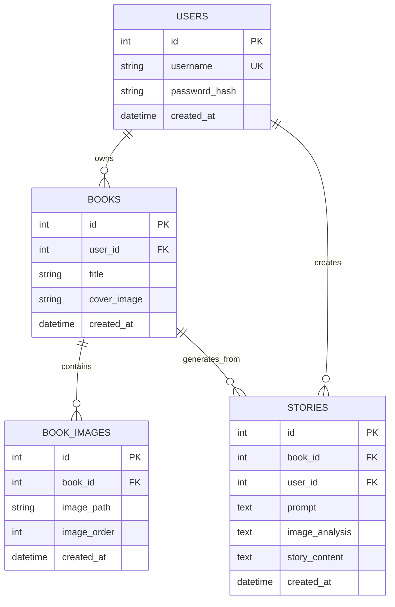

# 基于多模态大模型的绘本讲述应用（毕业论文项目）

## 1. 项目定位
本项目对应毕业设计题目《基于多模态大模型的绘本讲述应用》，面向“绘本插画输入 -> 图像语义理解 -> 图文对齐 -> 故事生成 -> 讲述展示与交互 -> 质量评估”的完整流程，构建可运行的后端系统原型。

## 2. 研究与实现方向
项目重点覆盖以下研究与实现方向：
- 插画输入处理与多图像序列建模
- 视觉特征提取与结构化语义信息（角色/场景/情绪）组织
- 跨模态对齐（视觉信息到文本讲述）
- 条件化讲述生成（语气/长度/适龄控制）
- 讲述结果展示与基础交互
- 质量评估（图文对应性、连贯性、适龄性、趣味性/用户体验）

## 3. 当前系统功能（后端）
- 用户注册、登录
- 绘本创建、查询、删除
- 绘本图片上传与查询
- 故事生成（Mock AI 服务层，便于后续接入真实多模态模型）
- 故事记录保存与历史查询
- 故事质量评估接口（可解释评分）

## 4. 技术栈
- Python 3.11
- FastAPI
- SQLAlchemy
- Pydantic
- SQLite / MySQL（可切换）
- Redis（缓存）
- Pillow（图像基础信息读取）

## 5. 项目结构
```text
app/
  core/        # 配置与基础能力（如缓存）
  db/          # 数据库连接、会话、初始化
  models/      # ORM 实体
  schemas/     # 请求/响应模型
  services/    # 业务逻辑
  routers/     # 接口路由
  utils/       # 工具函数（安全、通用能力）
  main.py      # 应用入口
```

## 6. 开发顺序
1. `app/core/config.py`
2. `app/db/base.py` + `app/db/session.py` + `app/db/init_db.py` + `app/db/__init__.py`
3. `app/models/*.py`
4. `app/schemas/*.py`
5. `app/utils/security.py`
6. `app/services/*.py`
7. `app/routers/*.py`
8. `app/main.py`
9. `tests/test_health.py`

## 7. Schemas 图


## 8. 数据库 ER 图


## 9. 后续工作
- 接入真实多模态模型（替换 Mock AI 服务层）
- 完善图文对齐与多页上下文一致性策略
- 增强讲述交互（用户偏好、风格连续调节）
- 完成小规模用户测试与指标统计分析
