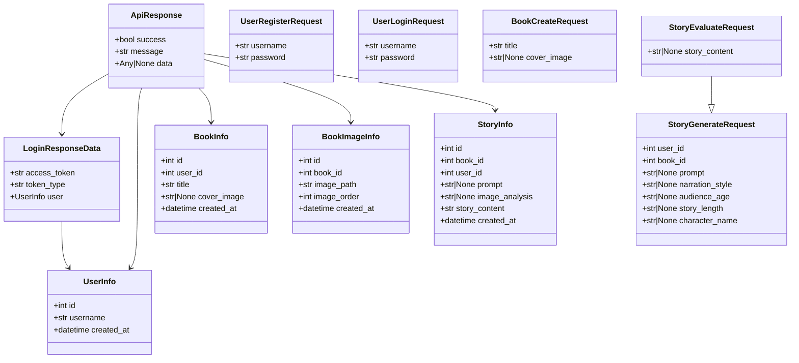
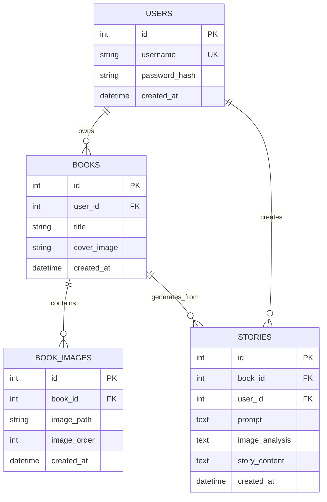

# AI 绘本故事生成网站

这个目录是给你从 0 到 1 手写代码用的。
我已经帮你把文件创建好，每个文件里都有注释提示。

## 手写顺序（严格按这个来）
1. `app/core/config.py`
2. `app/db/base.py` + `app/db/session.py` + `app/db/init_db.py` + `app/db/__init__.py`
3. `app/models/*.py`
4. `app/schemas/*.py`
5. `app/utils/security.py`
6. `app/services/*.py`
7. `app/routers/*.py`
8. `app/main.py`
9. `tests/test_health.py`

## Schemas 图

## 数据库 ER 图

